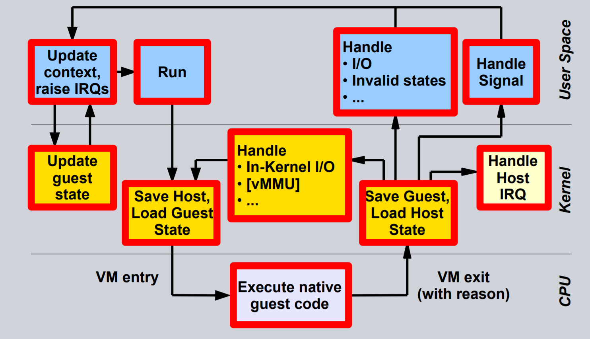

# Tìm Hiểu KVM Hypervisor
* Tuần 2
* Người thực hiện: Nguyễn Xuân Lưu
## [1. Giới thiệu chung về công nghệ ảo hóa](#vir)
## [2. Giới thiệu chung về KVM](#kvm)
## [3. Các thành phần của KVM](#internal)
## [Tài Liệu Tham Khảo](#thamkhao)

## <a name="vir"> </a>1. Giới thiệu chung về công nghệ ảo hóa
  **Ảo hóa** là một cách tiếp cận nhằm chia sẻ tài nguyên để đơn giản hóa việc quản lý và tăng giá trị sử dụng của tài nguyên công nghệ. Điều này dẫn đến việc tối ưu hóa các yêu cầu về kinh tế. Trong công nghệ, ảo hóa được hiểu đơn giản là công nghệ tạo ra môi trường phần cứng không thực.
  
  **Tại sao cần ảo hóa?**
  
  Vấn đề ảo hóa đặt ra ở những hệ thống lưu trữ, xử lý dữ liệu lớn. Lý do đầu tiên dẫn tới cần ảo hóa là việc sử dụng không đúng hiệu năng của phần cứng. Trước khi xu hướng ảo hóa xuất hiện, nhiều trung tâm dữ liệu chỉ phục vụ và lữu trữ ở mức 10% hoặc ít hơn dung lượng của chúng. Điều này thúc đẩy các nhà khoa học phải giải quyết vấn đề này. Ngày nay, khi công nghệ ảo hóa được áp dụng, hiệu năng sử dụng phần cứng của các tổ chức đã tăng từ 10% lên đến 70% - 80%.
  
  Tiếp đến, lý do thứ hai là do các trung tâm dữ liệu dễ dàng bị quá tải với khối lượng dữ liệu lớn từ nhiều dịch vụ khác nhau. Với sự phổ cập của Internet và các dịch vụ liên quan bao gồm email, website, video và ứng dụng di động, khối lượng dữ liệu lớn nếu chỉ được xử lý trên một hệ thống thì trung tâm dữ liệu dễ dàng bị quá tải. Phương án đưa ra để giải quyết là xây dựng thêm những trung tâm dữ liệu mới. Điều này thật quá tốn kém. Công nghệ ảo hóa cho phép chạy song song nhiều hệ thống khác nhau trên duy nhất một nền tảng phần cứng. Đồng nghĩa là, rắc rối với việc xử lý nhiều dịch vụ sẽ được giải quyết.
  
  Lý do thứ ba được đưa ra là vấn đề chi phí năng lượng. Các hệ thống lớn chạy rất tốn điện. Hiệu năng giảm xuống đồng nghĩa với lượng điện lãng phí tăng lên đáng kể. Việc sử dụng công nghệ ảo hóa tạo giảm chi phí sử dụng điện cho các tổ chức khi chính công nghệ này làm tăng hiệu năng của các thiết bị phần cứng.
  
  Cuối cùng, việc ảo hóa làm tăng hiệu quả quản lý hệ thống. Ảo hóa đồng nghĩa với giảm số thiết bị phần cứng được sử dụng. Vậy là, việc bảo trì, sửa chữa, thay mới, nâng cấp các thiết bị sẽ diễn ra ít hơn, chi phí cho các hoạt động này cũng giảm xuống. Tiếp nữa, ảo hóa cho phép các hệ thống chạy độc lập với phần cứng thật. Việc sao lưu trở nên dễ dàng. Kế đến, ảo hóa cho phép di chuyển các hệ thống từ phần cứng này sang phần cứng khác mà không cần mất thời gian tạm dừng hoạt động. Điều này là một ưu điểm vô cùng lớn của công nghệ ảo hóa.
  
  Và dù vì rất nhiều lý do, công nghệ ảo hóa đã được toàn thế giới chấp nhận, sử dụng và đang ảnh hưởng tới toàn bộ hoạt động của thế giới hiện nay.
  
 **Các loại ảo hóa**
 
 
 Dựa trên hình chúng ta có thể thấy, ảo hóa sẽ được thực hiện trên mọi thành phần. Ví dụ, công nghệ SDN (Software Define Network) thực hiện ảo hóa mạng, công nghệ SDS (Software Define Storage) thực hiện ảo hóa lưu trữ, … Trong khuôn khổ tìm hiểu về KVM, chúng ta tập chung vào Software Virtualization.

## <a name="kvm"></a>2. Giới thiệu chung về KVM

### <a name ="protect_ring"></a>2.1 Công nghệ Hardware-assisted Virtualization
Trong khoa học máy tính, khái niệm Protection Rings hay hierarchical protection domains dùng để chỉ các mức độ phân cấp truy cập dữ liệu của hệ thống.


Sự phân cấp này giúp bảo vệ dữ liệu và ngăn ngừa các lỗi xảy ra về bảo mật khi hệ thống hoạt động. Cũng chính nhờ sự phân cấp này mà tính bảo mật của hệ thống máy tính được đảm bảo.

Như hình trên, các mức phân quyền được đánh số từ cao nhất tới thấp nhất. Mức Ring 0 có quyền cao nhất và trực tiếp tương tác được với phần cứng vật lý như CPU và bộ nhớ. Mức Ring 1 và 2 thường ít được sử dụng. Hầu hết các hệ thống nói chung đều chỉ sử dụng hai mức phần quyền, thậm chí kể cả khi CPU hỗ trợ nhiều mức phân quyền hơn. Hai chế độ chính của CPU là kernel mode và user mode. Từ quan điểm hệ thống, Ring 0 được gọi là kernel mode hay supervisor mode và Ring 3 là user mode. Như chúng ta để ý thấy trên hình, các ứng dụng sẽ được chạy ở Ring 3.

Các hệ điều hành như Linux hay Windows cũng đều sử dụng mô hình supervisor/kernel mode và user mode. Một user mode hầu như không thể làm được gì nếu nó không nhờ đến sự trợ giúp từ kernel mode. Bởi vì chỉ kernel mode mới có quyền truy cập vào bộ nhớ, CPU và các cổng IO. Do vậy, hệ điều hành Linux hay Windows sẽ đều chạy ở mức kernel mode hay Ring 0 để có quyền quản lý tài nguyên và truy cập phần cứng.

Vấn đề về phân quyền truy cập sẽ không có gì đáng bàn khi sử dụng một hệ thống thông thường. Tuy nhiên, khi thực hiện ảo hóa, vấn đề này trở nên phức tạp. Các công cụ ảo hóa (hypervisor/virtual machine monitor) đều cần truy cập bộ nhớ, CPU và thiết bị ngoại vi từ phần cứng vật lý. Bởi vì vậy, nghiễm nhiên, hypervisor phải được đặt ở Ring 0. Và vì hypervisor chiếm chỗ, các máy ảo ( Virtual Machines hay VM) sẽ không có khả năng đặt ở Ring 0 nữa. Mặt khác, các hệ điều hành khi được cài đặt như một máy ảo cũng không biết được rằng chúng là máy ảo. Hệ điều hành của máy ảo sẽ vẫn yêu cầu quyền truy cập tất cả mọi tài nguyên ở mức Ring 0 như thông thường. Và vậy là, ta phải tìm cách đặt máy ảo chạy ở các mức Ring khác hoặc chỉnh sửa lại nó để nó chạy ở chế độ user mode.

Intel và AMD đều nhận ra sự thách thức trên. Họ đã độc lập phát triển một tính năng mới cho các dòng vi xử lý kiến trúc X86 của mình. Tính năng này có tên là Hardware-assisted Virtualization. Intel gọi nó là Virtualization Technology (VT) và AMD gọi nó là Secure Virtual Machine (SVM). Tính năng này cho phép các máy ảo chạy ở đúng mức phân quyền mong muốn là Ring 0. Còn vị trí vốn có Ring 0 là các hypervisor sẽ chạy ở một mức phân quyền mới là Ring -1. Do sự hỗ trợ này, hiệu năng ảo hóa tăng lên đáng kể và việc thiết kế một giải pháp ảo hóa cũng trở nên đơn giản hơn. KVM chính là ví dụ điển hình nhất sử dụng công nghệ ảo hóa mới này.


Để kiểm tra sự hỗ trợ của công nghệ Hardware-assisted Virtualization, ta có hai cách.

Thứ nhất, kiểm tra thông qua file /proc/cpuinfo. Trong màn hình terminal, gõ lệnh:

```shell
grep --color -Ew 'vmx|svm|lm' /proc/cpuinfo
```

Lệnh trên sẽ tiến hành tìm kiếm các từ vmx, svm, lm trong file cpuinfo. Ý nghĩa các cụm từ ấy như sau:
* vmx : Virtual Machine Extension Công nghệ ảo hóa phần cứng VT-x do cpu Intel hỗ trợ
* svm : Secure Virtual Machine Công nghệ ảo hóa phần cứng AMD-V do cpu AMD hỗ trợ
* lm : hỗ trợ 64-bit
Nếu có xuất hiện các từ ấy nghĩa là cpu hỗ trợ các công nghệ ấy. Điều kiện là máy bạn phải hỗ trợ vmx hoặc svm. Ví dụ:

```shell
flags		: fpu vme de pse tsc msr pae mce cx8 apic sep mtrr pge mca cmov pat pse36 clflush dts acpi mmx fxsr sse sse2 ss ht tm pbe syscall nx pdpe1gb rdtscp lm constant_tsc arch_perfmon pebs bts rep_good nopl xtopology nonstop_tsc cpuid aperfmperf pni pclmulqdq dtes64 monitor ds_cpl vmx est tm2 ssse3 sdbg fma cx16 xtpr pdcm pcid sse4_1 sse4_2 movbe popcnt tsc_deadline_timer aes xsave avx f16c rdrand lahf_lm abm cpuid_fault epb invpcid_single pti ssbd ibrs ibpb stibp tpr_shadow vnmi flexpriority ept vpid fsgsbase tsc_adjust bmi1 avx2 smep bmi2 erms invpcid xsaveopt dtherm ida arat pln pts flush_l1d
```

Thứ hai, kiểm tra thông qua thông tin về CPU. Trong màn hình terminal, gõ

```shell
lscpu
```

Lệnh trên sẽ hiển thị các thông số của CPU, tại dòng Virtualization, ta có thể nhìn thấy được công nghệ ảo hóa được hỗ trợ. Ví dụ:

```shell
Architecture:          x86_64
CPU op-mode(s):        32-bit, 64-bit
Byte Order:            Little Endian
CPU(s):                4
On-line CPU(s) list:   0-3
Thread(s) per core:    2
Core(s) per socket:    2
Socket(s):             1
NUMA node(s):          1
Vendor ID:             GenuineIntel
CPU family:            6
Model:                 69
Model name:            Intel(R) Core(TM) i5-4210U CPU @ 1.70GHz
Stepping:              1
CPU MHz:               2304.050
CPU max MHz:           2700,0000
CPU min MHz:           800,0000
BogoMIPS:              4788.72
Virtualization:        VT-x
L1d cache:             32K
L1i cache:             32K
L2 cache:              256K
L3 cache:              3072K
NUMA node0 CPU(s):     0-3
```

### <a name="kvm2"></a>2.2 Kernel-based Virtual Machine

Kernel-based Virtual Machine (KVM) là một module của Linux Kernel. KVM được giới thiệu lần đầu vào ngày 19/10/2006 bởi Avi Kivity. KVM đại diện cho thế hệ phần mềm ảo hóa mã nguồn mở mới nhất. Mục tiêu của dự án là tạo ra phần mềm ảo hóa hiện đại dựa trên kinh nghiệm của những thế hệ công nghệ ảo hóa trước đó và sự thúc đẩy từ công nghệ phần cứng hiện đại VT-x, AMD-V.

KVM chuyển đỗi Linux Kernel thành một hypervisor. Thông qua KVM, các máy ảo được cài đặt (guestOS) có thể chạy trực tiếp guest code trên CPU vật lý. KVM không hoạt động riêng rẽ mà nó cần tới sự hỗ trợ của QEMU. QEMU là một phần mềm chạy trên user mode có năng lực mô phỏng (emulation) các phần cứng vật lý. Nó có thể mô phỏng các bộ xử lý và hầu hết các thiết bị ngoại vi như ổ đĩa, mạng, VGA, PCI, USB, serial/parallel port nhằm tạo ra môi trường phần ứng ảo hóa hoàn chỉnh để cài đặt các máy ảo trên nó.

### <a name="kvm3"></a>2.3 Kiến trúc tổng quát của KVM

Nhìn tổng thể, để tìm hiểu về KVM ta cần quan tâm tới kiến trúc tổng quát của KVM. KVM gồm hai thành phần chính là qemu-kvm và kvm.ko. qemu-kvm về bản chất chính là bản chỉnh sửa từ QEMU gốc. qemu-kvm đảm nhiệm vai trò mô phỏng các phần cứng ảo cho hoạt động của máy ảo. qemu-kvm làm việc ở user mode. Phần còn lại chính là kvm.ko . kvm.ko là một kernel module được tích hợp sẵn trong Linux Kernel từ phiên bản Linux Kernel 2.6.60. kvm.ko đảm nhiệm vai trò hỗ trợ máy ảo chạy trực tiếp native code trên CPU vật lý. Một thành phần cần thiết khác để giúp KVM hoạt động là libvirt. libvirt đảm nhiệm vai trò nhận yêu cầu quản trị từ người dùng và chuyển nó sang cho hypervisor(ở đây là KVM) thực hiện. Các thành phần này sẽ được tìm hiểu kỹ ở chương tiếp theo.

## <a name="internal"></a>3. Các thành phần của KVM
### 3.1 Libvirt

Libvirt là một lớp trừu tượng trung gian giữa hypervisor và các công cụ quản lý máy ảo.


Libvirt không chỉ hỗ trợ KVM mà còn hỗ trợ các hypervisor khác như Xen, ESX, OpenVZ,... Như đã nói từ chương trước, mục tiêu của libvirt là cung cấp một lớp chung ổn định để hỗ trợ việc quản lý các máy ảo chạy trên một hypervisor. Công việc của libvirt và các libvirt tool sẽ là tạo, chỉnh sửa, giám sát, điều khiển, di chuyển,... các máy ảo. Trên Linux, libvirt chạy như một tiến trình nền (daemon). Tên của tiến trình nền đó là libvirtd. Dựa trên kết nối URI (Uniform Resource Identifier) và các yêu cầu nhận từ người dùng, libvirtd sẽ tạo kết nối tương ứng đến hypervisor. 

Đảm nhiệm việc nhận yêu cầu từ người dùng, Libvirt có 2 công cụ là virsh và virt-manager. virsh (virtual shell) là một command line interface cung cấp giao diện dòng lệnh cho phép người dùng quản lý máy ảo. Nhìn chung virsh được sử dụng chủ yếu bởi người dùng có kinh nghiệm. Bên cạnh đó, một công cụ khác phổ biến là virt-manager. virt-manager là một graphic user interface cung cấp giao diện đồ họa người dùng cho phép người dùng quản lý máy ảo. virt-manager trực quan dễ sử dụng. Hai công cụ này khi hoạt động sẽ nhận yêu cầu người dùng và yêu cầu libvirtd gửi lệnh tương ứng tới hypervisor.

Kế đến, mối quan hệ giữ libvirt và hypervisor như thế nào? Cụ thể, đối với KVM, libvirt sẽ tạo một tiến trình QEMU-KVM riêng biệt cho từng máy ảo. Thuộc tính của các máy ảo bao gồm số CPU, kích thước bộ nhớ, cấu hình các thiết bị IO sẽ được lưu trữ trong những file XML nằm trong thư mục /etc/libvirt/qemu. Các thuộc tính này sẽ được libvirtd sử dụng khi quản lý các máy ảo.

Việc sử dụng libvirt để quản lý các máy ảo sẽ được tiếp tục tìm hiều ở những phần sau.

### 3.2 QEMU

Quick Emulator (QEMU) là một công cụ mô phỏng (emulator) và ảo hóa (virtualizer). Khi được dùng ở chức năng mô phỏng, QEMU có thể làm cho các OS hoặc chương trình trên một hệ thống (ví dụ ARM board với kiến trúc RISC) chạy trên được một hệ thống khác (intel X86 có kiến trúc CISC). Công nghệ được QEMU sử dụng ở đây là dynamic translation.

Ở chế độ mô phỏng, QEMU là một hypervisor độc lập thực thụ. QEMU cho phép một hệ điều hành với kiến trúc A chạy trên nền tảng kiển trúc B. Công việc chuyển đỗi do công nghệ binary translation đảm nhiệm. Đối với QEMU, nó là Tiny Code Generator (TCG). TCG chuyển đỗi code viết cho một loại vi xử lý sang một loại khác để chạy. Công việc của TCG được mô tả đơn giản như hình dưới.


Ở chế độ ảo hóa, QEMU chạy các guest code trực tiếp trên CPU máy gốc dẫn đến hiệu năng xử lý đạt tối đa. Điều này sẽ diễn ra khi QEMU hoạt động đi cùng Xen hoặc KVM. Tất nhiên, bản QEMU hoạt động cùng KVM này sẽ có chỉnh sửa phù hợp so với bản gốc để tương thích với KVM. Bên cạnh việc tạo CPU ảo, QEMU còn hỗ trợ ảo hóa hầu hết các thiết bị ngoại vi khác như ổ đĩa, mạng, USB, PCI, VGA,... Khi hoạt động cùng KVM, QEMU còn hỗ trợ việc tạo và khởi chạy máy ảo, ảo hóa không gian địa chỉ vật lý cho máy ảo (virtual machine) trong không gian địa chỉ user mode của máy gốc (host machine). Ngoài ra, QEMU cũng hỗ trợ việc tạo ra các POSIX Thread cho vCPU của máy ảo. Mô hình chi tiết như hình dưới:


Để chạy được guest code trên CPU máy gốc thì QEMU sẽ tạo ra các posix thread. Các vCPU sẽ được chạy trên kernel máy gốc như các posix thread. Portable Operating System Interface hay posix là một chuẩn của IEEE dùng để định nghĩa một tập hợp các dịch vụ của hệ điều hành. Các chương trình tuân theo chuẩn POXIS có thể dễ dàng chuyển từ hệ thống này sang hệ điều hành khác. POSIX dựa trên các dịch vụ hệ thống của UNIX, nhưng nó được tạo theo một cách riêng cho phép nó có thể được cài đặt trên các hệ điều hành khác.

Trong mối quan hệ với KVM, QEMU sẽ thông qua một giao thức được định nghĩa là các hàm ioctls() tương tác với file device /dev/kvm. Thông qua các ioctls(), QEMU sẽ gửi lệnh tạo máy ảo, tạo vCPU,... và yêu cầu KVM thực hiện. Hoạt động nhịp nhàng giữa QEMU ở user mode và KVM ở kernel mode tạo nên một hypervisor hiệu năng cao.

### 3.3 KVM

KVM chứa một loadable kernel module tên gọi là kvm.ko. Với tương tác thông qua các hàm ioctls() kvm.ko tương tác với device file /dev/kvm để làm việc trực tiếp với phần cứng vật lý. Cũng vì lý do tương tác với phần cứng vật lý mà cụ thể là CPU. kvm.ko sẽ có hai modules khác nhau là kvm-intel.ko và kvm-amd.ko . kvm-intel.ko sẽ được hoạt động khi cờ vmx (Virtual Machine Extension) được bật. Tức là ứng với dòng CPU intel hỗ trợ công nghệ Virtualization Technology (VT-x). kvm-amd.ko sẽ được hoạt động khi cờ svm (Secure Virtual Machine) được bật. Tức là ứng với dòng CPU AMD hỗ trợ công nghệ AMD-V.

Các hàm ioctls() còn được gọi là KVM API. Cụ thể, sẽ có 3 dạng chính:

- system ioctls: chúng là các hàm ở cấp độ hệ thống, sẽ truy vấn và cài đặt các thuộc tính toàn cục, ảnh hưởng tới toàn bộ hệ thống của KVM, chẳng hạn như tạo một máy ảo mới.

- vm ioctls: chúng là các hàm truy vấn và cài đặt các thuộc tính ảnh hưởng tới một máy ảo, chẳng hạn như tạo một virtual CPU. Chúng được hiểu là các tiến trình (process).

- vcpu ioctls: chúng là các hàm truy vấn và cài đặt các thuộc tính ảnh hưởng tới một vCPU. Chúng được hiểu là các luồng (thread).

Về hoạt động sâu bên trong, ta tìm hiểu thông qua sơ đồ làm việc của vCPU như sau:



Hoạt động sâu bên trong ở mức kernel mode tương đối phức tạp. Khi chạy các tiến trình máy ảo, các tiến trình hiện tại của máy gốc sẽ được tạm dừng và sẽ được khôi phục khi tiến trình máy ảo được thực hiện hoàn thành.

## <a name="thamkhao"></a> Tài Liệu Tham Khảo

* Humble Devassy Chirammal, Prasad Mukhedkar, Anil Vettathu, *Mastering KVM Virtualization*, Packt Publishing, 2016
* www.linux-kongress.com truy nhập cuối cùng ngày 09/09/2018
* www.linux-kvm.org truy nhập cuối cùng ngày 08/09/2018


